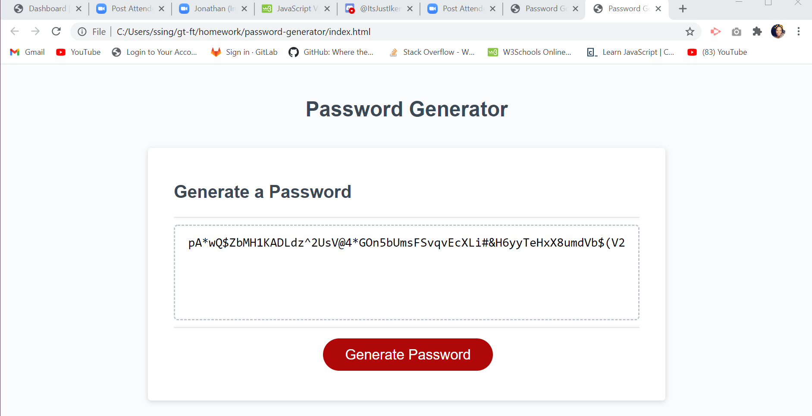

# Password Generator 

The project password generator was designed to create an application that an employee could use to generate their own personal password. The objective was for this design to produce a random password based on criteria selected for the user to choose from. By applying different Javascript principles, the user will be able to establish a password based on their input to the selected prompts. 

-Created variables that would target that values that could inter change the values such as upper or lower case letters, numeric values, and the special characters. 

-Prompts were added to ask the user which variables they would like to have inputted into their random password. 

-Conditional statements were added so if the user chose one prompt over the other they could achieve the same result of a password chosen at random. 

-A for loop was integrated to ensure that any of the intended characters could be selected given the specific criteria. 

-A function was incorporated to ensure the return of a generated password. 

-An addEventListener method was also added to ensure once the user selected the generate password, the user could follow the prompt to yield the outcome of a random password. 

# Installation

To run this locally, fork the repo, clone it, and open the 'index.html' in your default browser.  

## Usage

This application should be deployed within a browser and when the generate password button is selected, the user should follow the prompts as they appear on the screen 

### Credits

* Used Bootstrap's grid system, (containers, rows, and columns).

* W3 Schools 

* 02-ask-the-class

* Study Groups 

* 03-resources  

### Moc-Up

### License 

Copyright (c) [2020] [Selena Singleton]

Permission is hereby granted, free of charge, to any person obtaining a copy
of this software and associated documentation files (the "Software"), to deal
in the Software without restriction, including without limitation the rights
to use, copy, modify, merge, publish, distribute, sublicense, and/or sell
copies of the Software, and to permit persons to whom the Software is
furnished to do so, subject to the following conditions:

The above copyright notice and this permission notice shall be included in all
copies or substantial portions of the Software.

THE SOFTWARE IS PROVIDED "AS IS", WITHOUT WARRANTY OF ANY KIND, EXPRESS OR
IMPLIED, INCLUDING BUT NOT LIMITED TO THE WARRANTIES OF MERCHANTABILITY,
FITNESS FOR A PARTICULAR PURPOSE AND NONINFRINGEMENT. IN NO EVENT SHALL THE
AUTHORS OR COPYRIGHT HOLDERS BE LIABLE FOR ANY CLAIM, DAMAGES OR OTHER
LIABILITY, WHETHER IN AN ACTION OF CONTRACT, TORT OR OTHERWISE, ARISING FROM,
OUT OF OR IN CONNECTION WITH THE SOFTWARE OR THE USE OR OTHER DEALINGS IN THE
SOFTWARE.
